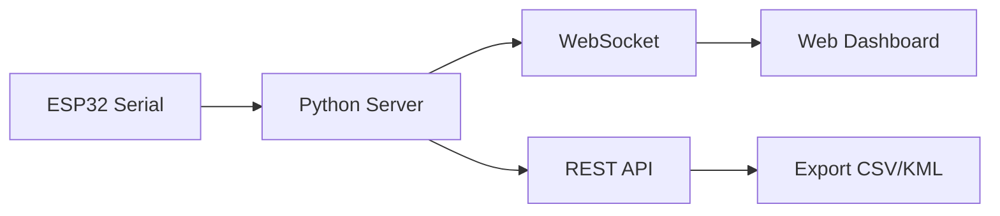
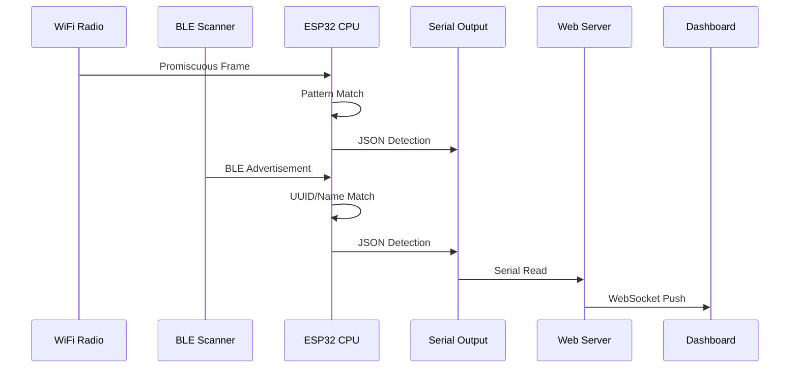

# Project Architecture

Flock You is an ESP32-S3 firmware built with PlatformIO that detects surveillance devices using WiFi and BLE scanning. This document outlines the project structure and key components.

## System Overview

```
┌─────────────────────────────────────────────────────┐
│                   ESP32-S3 MCU                       │
│  ┌─────────────┐  ┌─────────────┐  ┌─────────────┐  │
│  │   Core 0    │  │   Core 1    │  │   WiFi/BLE  │  │
│  │ Main Loop   │  │ BLE Scanner │  │   Radio     │  │
│  └─────────────┘  └─────────────┘  └─────────────┘  │
│         │                │                │         │
│  ┌──────┴────────────────┴────────────────┴──────┐  │
│  │              FreeRTOS Scheduler               │  │
│  └───────────────────────────────────────────────┘  │
│         │                │                │         │
│  ┌──────┴──────┐  ┌──────┴──────┐  ┌──────┴──────┐  │
│  │   Buzzer/   │  │   Flash     │  │   USB-CDC   │  │
│  │   RGB LED   │  │   Storage   │  │   Serial    │  │
│  └─────────────┘  └─────────────┘  └─────────────┘  │
└─────────────────────────────────────────────────────┘
```

## Directory Structure

```
flock-you/
├── platformio.ini          # PlatformIO configuration
├── src/
│   └── main.cpp           # Main firmware source
├── api/
│   ├── flockyou.py        # Python web server
│   ├── requirements.txt   # Python dependencies
│   └── templates/
│       └── index.html     # Web dashboard
├── datasets/
│   └── *.csv              # Detection pattern databases
└── mkdocs/
    └── docs/              # Documentation
```

## Firmware Components

### Main Entry Point

The firmware runs on FreeRTOS and initializes multiple detection subsystems:

```cpp title="src/main.cpp"
void setup() {
    Serial.begin(115200);
    
    // Initialize buzzer
    pinMode(BUZZER_PIN, OUTPUT);
    boot_beep_sequence();
    
    // Initialize WiFi promiscuous mode
    wifi_init_promiscuous();
    
    // Initialize BLE scanning
    NimBLEDevice::init("FlockYou");
    pBLEScan = NimBLEDevice::getScan();
    pBLEScan->setActiveScan(true);
}
```

## Detection Subsystems

### WiFi Promiscuous Mode

Captures WiFi frames without association:

| Feature | Description |
|---------|-------------|
| **Channel Hopping** | Scans all 13 channels |
| **Probe Requests** | Captures device probe frames |
| **Beacon Frames** | Identifies access points |
| **SSID Matching** | Pattern-based SSID detection |
| **MAC Filtering** | OUI-based device identification |

### BLE Scanner

Monitors Bluetooth Low Energy advertisements:

| Feature | Description |
|---------|-------------|
| **Active Scanning** | Requests scan responses |
| **Name Matching** | Device name pattern detection |
| **Service UUIDs** | Raven device identification |
| **RSSI Tracking** | Signal strength monitoring |

## Detection Patterns

### WiFi SSID Patterns

```cpp
static const char* wifi_ssid_patterns[] = {
    "flock",           // Standard Flock Safety
    "Flock",           // Capitalized variant
    "FLOCK",           // All caps variant
    "FS Ext Battery",  // Extended Battery devices
    "Penguin",         // Penguin surveillance
    "Pigvision"        // Pigvision systems
};
```

### MAC Address Prefixes

Known surveillance device OUIs:

```cpp
static const char* mac_prefixes[] = {
    // FS Ext Battery devices
    "58:8e:81", "cc:cc:cc", "ec:1b:bd", "90:35:ea",
    
    // Flock WiFi devices
    "70:c9:4e", "3c:91:80", "d8:f3:bc", "80:30:49"
    // ... additional prefixes
};
```

### BLE Device Names

```cpp
static const char* device_name_patterns[] = {
    "FS Ext Battery",  // Flock Safety Extended Battery
    "Penguin",         // Penguin surveillance
    "Flock",           // Standard Flock Safety
    "Pigvision"        // Pigvision systems
};
```

### Raven Service UUIDs

Acoustic gunshot detector identification:

```cpp
static const char* raven_service_uuids[] = {
    "0000180a-0000-1000-8000-00805f9b34fb",  // Device Info
    "00003100-0000-1000-8000-00805f9b34fb",  // GPS Service
    "00003200-0000-1000-8000-00805f9b34fb",  // Power Service
    "00003300-0000-1000-8000-00805f9b34fb",  // Network Service
    // ... additional services
};
```

## Audio Alert System

```cpp
void beep(int frequency, int duration_ms) {
    tone(BUZZER_PIN, frequency, duration_ms);
    delay(duration_ms + 50);
}
```

| Alert | Frequency | Duration | Purpose |
|-------|-----------|----------|---------|
| Boot Low | 200 Hz | 300ms | Startup sequence |
| Boot High | 800 Hz | 300ms | Startup complete |
| Detection | 1000 Hz | 150ms x3 | Device detected |
| Heartbeat | 600 Hz | 100ms x2 | Device in range |

## JSON Output

Detections are output as JSON to serial:

```json
{
  "type": "Flock Safety",
  "mac": "3C:71:BF:12:34:56",
  "ssid": "FLOCK-S3-1234",
  "rssi": -62,
  "method": "wifi_ssid"
}
```

### Detection Methods

| Method | Description |
|--------|-------------|
| `wifi_ssid` | Matched WiFi SSID pattern |
| `wifi_mac` | Matched MAC prefix |
| `ble_name` | Matched BLE device name |
| `ble_uuid` | Matched BLE service UUID |

## Web Interface

The Python web server (`api/flockyou.py`) provides:



## Data Flow



## Configuration

Key settings in `main.cpp`:

| Constant | Default | Description |
|----------|---------|-------------|
| `BUZZER_PIN` | 3 | GPIO for buzzer |
| `BLE_SCAN_DURATION` | 1s | BLE scan window |
| `BLE_SCAN_INTERVAL` | 5000ms | Time between scans |
| `CHANNEL_HOP_INTERVAL` | 500ms | WiFi channel hop rate |
| `MAX_CHANNEL` | 13 | WiFi channels to scan |

## Next Steps

- [Learn about BLE detection](ble-protocol.md)
- [Explore detection types](detection-types.md)
- [Set up the web interface](web-interface.md)
