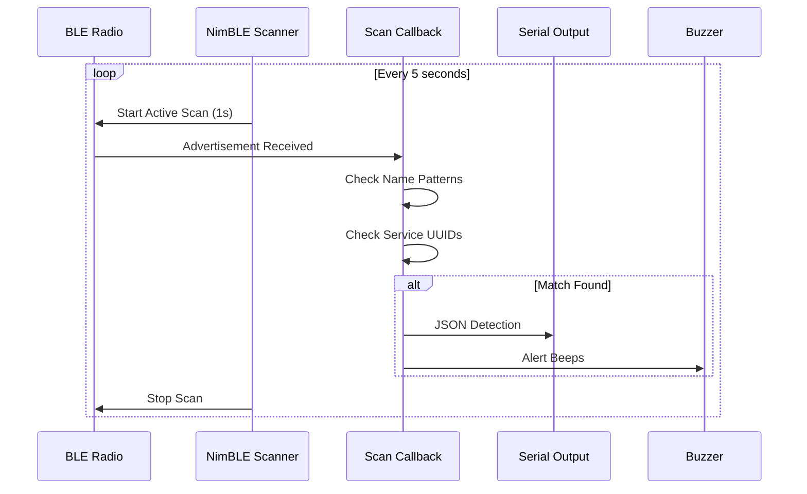

# BLE Detection

Flock You uses Bluetooth Low Energy (BLE) scanning to detect surveillance devices. This document describes the BLE detection methodology.

## Overview

The firmware uses NimBLE to scan for BLE advertisements from surveillance devices, specifically targeting:

- **Raven** acoustic gunshot detectors (SoundThinking/ShotSpotter)
- **Flock Safety** extended battery devices
- Other surveillance systems with BLE presence

## Scan Configuration

```cpp
#define BLE_SCAN_DURATION 1    // Seconds per scan
#define BLE_SCAN_INTERVAL 5000 // Milliseconds between scans
```

The scanner runs active scans to request scan responses, which may reveal additional device information.

## Detection Methods

### Device Name Matching

The firmware matches advertised device names against known patterns:

```cpp
static const char* device_name_patterns[] = {
    "FS Ext Battery",  // Flock Safety Extended Battery
    "Penguin",         // Penguin surveillance
    "Flock",           // Standard Flock Safety
    "Pigvision"        // Pigvision systems
};
```

### Service UUID Detection

Raven gunshot detectors are identified by their BLE service UUIDs:

| Service | UUID | Firmware Version |
|---------|------|------------------|
| Device Info | `0000180a-0000-1000-8000-00805f9b34fb` | All |
| GPS Location | `00003100-0000-1000-8000-00805f9b34fb` | 1.2.0+ |
| Power/Battery | `00003200-0000-1000-8000-00805f9b34fb` | 1.2.0+ |
| Network Status | `00003300-0000-1000-8000-00805f9b34fb` | 1.2.0+ |
| Upload Stats | `00003400-0000-1000-8000-00805f9b34fb` | 1.2.0+ |
| Error Service | `00003500-0000-1000-8000-00805f9b34fb` | 1.2.0+ |
| Health (Legacy) | `00001809-0000-1000-8000-00805f9b34fb` | 1.1.7 |
| Location (Legacy) | `00001819-0000-1000-8000-00805f9b34fb` | 1.1.7 |

## Raven Device Detection

Raven devices (acoustic gunshot detection) expose multiple BLE services that reveal their capabilities:

```cpp
// Check if device advertises Raven-specific services
bool isRavenDevice(NimBLEAdvertisedDevice* device) {
    for (int i = 0; i < device->getServiceUUIDCount(); i++) {
        std::string uuid = device->getServiceUUID(i).toString();
        for (const char* raven_uuid : raven_service_uuids) {
            if (uuid == raven_uuid) {
                return true;
            }
        }
    }
    return false;
}
```

### Raven Service Details

#### GPS Location Service (0x3100)
Reports device GPS coordinates for positioning the acoustic sensor.

#### Power Service (0x3200)
Reports battery level and solar charging status.

#### Network Service (0x3300)
Reports LTE/WiFi connectivity status for cloud uploads.

#### Upload Service (0x3400)
Reports statistics about audio event uploads.

## BLE Scan Callback

```cpp
class ScanCallbacks : public NimBLEScanCallbacks {
    void onResult(NimBLEAdvertisedDevice* device) {
        // Check device name patterns
        std::string name = device->getName();
        for (const char* pattern : device_name_patterns) {
            if (name.find(pattern) != std::string::npos) {
                handleDetection(device, "ble_name");
                return;
            }
        }
        
        // Check service UUIDs for Raven devices
        if (isRavenDevice(device)) {
            handleDetection(device, "ble_uuid");
        }
    }
};
```

## Signal Strength

RSSI values indicate proximity to detected devices:

| RSSI Range | Distance | Indication |
|------------|----------|------------|
| -30 to -50 | Very close | < 2 meters |
| -50 to -70 | Close | 2-10 meters |
| -70 to -85 | Medium | 10-30 meters |
| -85 to -100 | Far | > 30 meters |

!!! note "RSSI Accuracy"
    RSSI is affected by obstacles, interference, and antenna orientation. Use as a rough proximity indicator only.

## JSON Output

BLE detections are output as JSON:

```json
{
  "type": "Raven",
  "mac": "AA:BB:CC:DD:EE:FF",
  "name": "Raven-1234",
  "rssi": -65,
  "method": "ble_uuid",
  "services": ["0x180a", "0x3100", "0x3200"]
}
```

## Detection Flow



## Heartbeat System

When a device remains in range, the firmware provides periodic alerts:

```cpp
// If device still in range after 10 seconds, heartbeat beep
if (device_in_range && millis() - last_heartbeat > 10000) {
    beep(HEARTBEAT_FREQ, HEARTBEAT_DURATION);
    delay(100);
    beep(HEARTBEAT_FREQ, HEARTBEAT_DURATION);
    last_heartbeat = millis();
}
```

## Adding New Detection Patterns

To detect additional BLE devices:

1. **Device Name**: Add pattern to `device_name_patterns[]`
2. **Service UUID**: Add UUID to appropriate array
3. **MAC Prefix**: Add OUI to `mac_prefixes[]` (if known)

Example adding a new device type:

```cpp
// Add to device_name_patterns
"NewDevice",

// Add to service UUIDs if applicable
"00001234-0000-1000-8000-00805f9b34fb",
```

## Next Steps

- [Explore detection types](detection-types.md)
- [View project architecture](architecture.md)
- [Set up web interface](web-interface.md)
