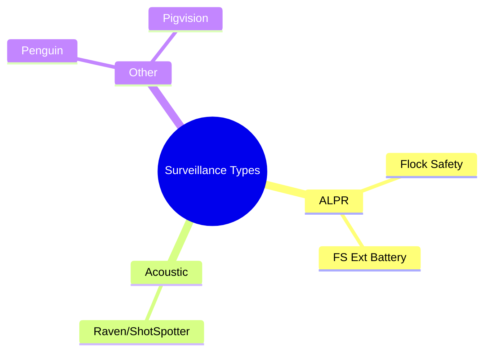

# Detection Types

Flock You detects various surveillance systems using WiFi and BLE scanning. This page documents all supported detection types and their identification methods.

## Surveillance Categories



## Primary Detection Targets

### :material-car: Flock Safety

| Property | Value |
|----------|-------|
| **Type** | ALPR (Automated License Plate Recognition) |
| **Operator** | Law Enforcement Agencies |
| **Detection** | WiFi SSID, MAC prefix, BLE name |

**Description:** Flock Safety cameras are automated license plate recognition systems deployed by law enforcement agencies. They capture license plates and vehicle characteristics to track vehicle movements.

**Identification Patterns:**

| Method | Pattern |
|--------|---------|
| WiFi SSID | `FLOCK-*`, `flock*`, `FLOCK*` |
| BLE Name | `Flock`, `FS Ext Battery` |
| MAC Prefix | `70:c9:4e`, `3c:91:80`, `d8:f3:bc`, etc. |

---

### :material-car-battery: FS Ext Battery

| Property | Value |
|----------|-------|
| **Type** | Extended Battery ALPR Unit |
| **Operator** | Law Enforcement Agencies |
| **Detection** | WiFi SSID, MAC prefix, BLE name |

**Description:** Extended battery variants of Flock Safety cameras for locations without power infrastructure.

**Identification Patterns:**

| Method | Pattern |
|--------|---------|
| WiFi SSID | `FS Ext Battery` |
| BLE Name | `FS Ext Battery` |
| MAC Prefix | `58:8e:81`, `cc:cc:cc`, `ec:1b:bd`, etc. |

---

### :material-volume-high: Raven (ShotSpotter)

| Property | Value |
|----------|-------|
| **Type** | Acoustic Gunshot Detector |
| **Operator** | SoundThinking / Law Enforcement |
| **Detection** | BLE Service UUIDs |

**Description:** Raven devices are acoustic surveillance sensors that detect gunshots and other loud sounds. Part of the SoundThinking (formerly ShotSpotter) network.

**Identification Patterns:**

| Service UUID | Purpose |
|--------------|---------|
| `0000180a-...` | Device Information |
| `00003100-...` | GPS Location |
| `00003200-...` | Power/Battery Status |
| `00003300-...` | Network Status |
| `00003400-...` | Upload Statistics |
| `00003500-...` | Error Reporting |

See [BLE Detection](ble-protocol.md) for full UUID details.

---

### :material-penguin: Penguin

| Property | Value |
|----------|-------|
| **Type** | Surveillance Device |
| **Detection** | WiFi SSID, BLE name |

**Description:** Penguin surveillance devices detected by WiFi and BLE patterns.

**Identification Patterns:**

| Method | Pattern |
|--------|---------|
| WiFi SSID | `Penguin*` |
| BLE Name | `Penguin` |

---

### :material-pig: Pigvision

| Property | Value |
|----------|-------|
| **Type** | Surveillance System |
| **Detection** | WiFi SSID, BLE name |

**Description:** Pigvision surveillance systems detected by network patterns.

**Identification Patterns:**

| Method | Pattern |
|--------|---------|
| WiFi SSID | `Pigvision*` |
| BLE Name | `Pigvision` |

---

## Detection Methods

### WiFi SSID Matching

The firmware captures WiFi beacon frames and probe requests, matching SSIDs against known patterns:

```cpp
static const char* wifi_ssid_patterns[] = {
    "flock",
    "Flock",
    "FLOCK",
    "FS Ext Battery",
    "Penguin",
    "Pigvision"
};
```

### MAC Address Filtering

Known surveillance device MAC prefixes (OUIs) are checked:

```cpp
static const char* mac_prefixes[] = {
    // FS Ext Battery devices
    "58:8e:81", "cc:cc:cc", "ec:1b:bd",
    
    // Flock WiFi devices
    "70:c9:4e", "3c:91:80", "d8:f3:bc"
    // ... more prefixes
};
```

### BLE Name Matching

Device names in BLE advertisements are matched:

```cpp
static const char* device_name_patterns[] = {
    "FS Ext Battery",
    "Penguin",
    "Flock",
    "Pigvision"
};
```

### BLE Service UUID Detection

Raven devices are identified by their unique service UUIDs advertised via BLE.

## JSON Output Format

Each detection outputs JSON to serial:

```json
{
  "type": "Flock Safety",
  "mac": "3C:71:BF:12:34:56",
  "ssid": "FLOCK-S3-1234",
  "rssi": -62,
  "method": "wifi_ssid"
}
```

### Fields

| Field | Description |
|-------|-------------|
| `type` | Detection category |
| `mac` | Device MAC address |
| `ssid` | WiFi SSID (if applicable) |
| `name` | BLE device name (if applicable) |
| `rssi` | Signal strength (dBm) |
| `method` | How device was detected |

### Detection Methods

| Method | Description |
|--------|-------------|
| `wifi_ssid` | Matched WiFi SSID pattern |
| `wifi_mac` | Matched MAC address prefix |
| `ble_name` | Matched BLE device name |
| `ble_uuid` | Matched BLE service UUID |

## Adding New Detection Types

To add support for new surveillance systems:

1. **WiFi SSID**: Add pattern to `wifi_ssid_patterns[]`
2. **MAC Prefix**: Add OUI to `mac_prefixes[]`
3. **BLE Name**: Add pattern to `device_name_patterns[]`
4. **BLE UUID**: Add UUID to `raven_service_uuids[]`

Example:

```cpp
// Add to wifi_ssid_patterns
"NewSurveillance",

// Add to mac_prefixes (if known OUI)
"AA:BB:CC",

// Add to device_name_patterns
"NewDevice",
```

## Data Sources

Detection patterns are derived from:

- Real device databases (see `datasets/` folder)
- Wigle.net wardriving data
- Community contributions
- Manual device analysis

## Next Steps

- [Learn about BLE detection](ble-protocol.md)
- [View project architecture](architecture.md)
- [Set up web interface](web-interface.md)
